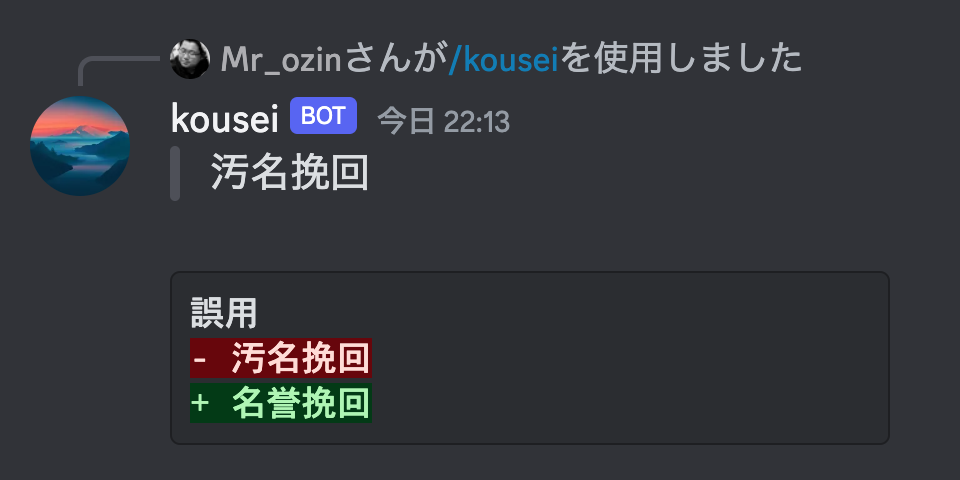

<div align="center">
    
</div>

---

<p align="center">
  <a href="https://discordapp.com/users/1181098864963498094">
    <b>Add Discord Bot</b>
  </a>
</p>

---

# Kousei (Discord Bot with Cloudflare Workers)

A Discord Bot for Japanese proofreading with `/kousei` slash commend.

Implemented in [Hono](https://github.com/honojs/hono/tree/main).

## Note

If you would like to run, you will need this.

- Yahoo App ID (API Key)
- Discord Public Key
- Discord Application ID
- Discord Token

Read this doc.

https://developer.yahoo.co.jp/sitemap/

https://discord.com/developers/docs/tutorials/hosting-on-cloudflare-workers

And, copy `example.dev.vars` to `.dev.vars`, and replace that.

```ini
YAHOO_APP_ID = "..."
DISCORD_APPLICATION_ID = "..."
DISCORD_TOKEN = "..."
DISCORD_PUBLIC_KEY = "..."
```

## CLI

### Development

```shell
# install dependencies
pnpm install
# setup slash command
pnpm run register
# dev server
pnpm run dev
```

run another terminal [ngrok](https://ngrok.com/).

```shell
ngrok http 8787
```

and setup endpoint url.

https://discord.com/developers/docs/tutorials/hosting-on-cloudflare-workers#setting-up-ngrok

in this repo, default endpoint URL is `<ROOT>/api/interactions` for bot.

### Production

```shell
# setup slash command
pnpm run register
# deploy to Cloudflare Workers with Wrangler
pnpm run deploy
```

Don't forget to setup `Interactions Endpoint URL`, this URL is maybe `*.*.workers.dev/api/interactions`.

## Referenced

https://github.com/discord/cloudflare-sample-app

## License

MIT
